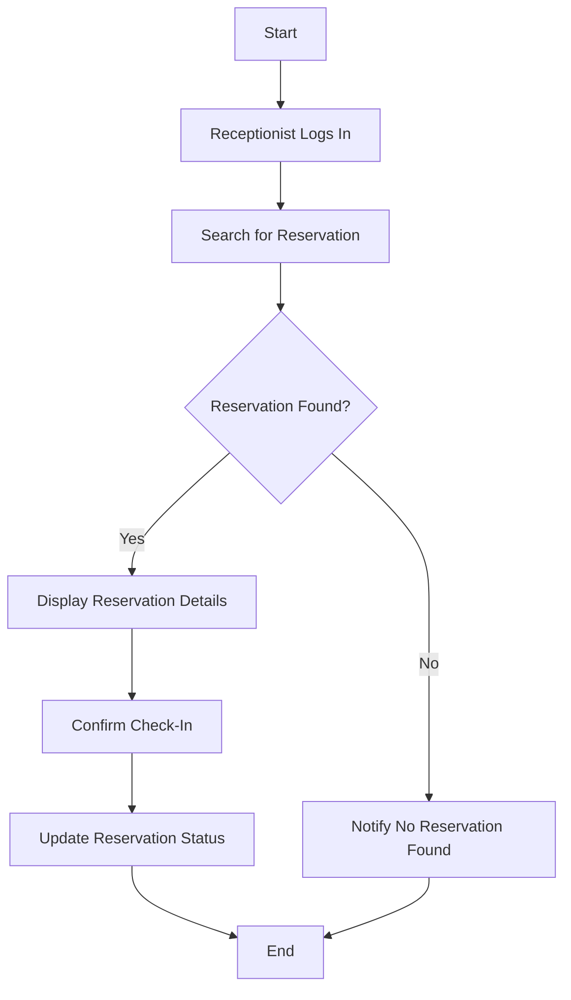

# Hotel Management System Design Documentation

## 1. Introduction
This document outlines the design specification for the Hotel Management System, based on the requirements provided.

## 2. Core Entities and Relationships
- **RoomType**: Defines the type of room (e.g., single, double, suite).
- **Room**: Represents individual rooms with a room number and type.
- **Guest**: Information about guests staying at the hotel.
- **Reservation**: Details of room reservations, including start date, length of stay, and associated guest.
- **PromotionalDiscount**: Discount codes and their percentage.
- **User**: System users with roles (Receptionist, Manager, IT Administrator).

## 3. UML Class Diagram

## 4. Database Schema

## 5. System Architecture

## 6. Detailed Design
### 6.1 RoomType
- **Attributes**:
  - name: String
  - price: float
  - quality: String
  - bathroomFeatures: String
  - maxGuests: int

### 6.2 Room
- **Attributes**:
  - roomNumber: int
  - type: RoomType

### 6.3 Guest
- **Attributes**:
  - fullName: String
  - address: String
  - phoneNumber: String
  - email: String

### 6.4 Reservation
- **Attributes**:
  - startDate: Date
  - lengthOfStay: int
  - numberOfGuests: int
  - discount: PromotionalDiscount
  - price: float
  - notes: String
  - checkedIn: boolean
  - checkedOut: boolean
  - room: Room
  - guest: Guest

### 6.5 PromotionalDiscount
- **Attributes**:
  - code: String
  - percentage: float

### 6.6 User
- **Attributes**:
  - username: String
  - password: String
  - role: String

## 7. Sequence Diagrams
### 7.1 Room Reservation

### 7.2 Guest Check-In

## 8. Activity Diagrams
### 8.1 Room Reservation Workflow

### 8.2 Guest Check-In Workflow

## 9. Decision Tables
### 9.1 Room Availability Check
| Condition | Action |
|-----------|--------|
| Room is available | Display room details |
| Room is not available | Notify no available rooms |

### 9.2 Reservation Confirmation
| Condition | Action |
|-----------|--------|
| Reservation confirmed | Save reservation |
| Reservation not confirmed | End process |

## 10. References
- Requirements Specification Document
- UML Diagrams and ER Diagrams
- System Architecture Diagram
